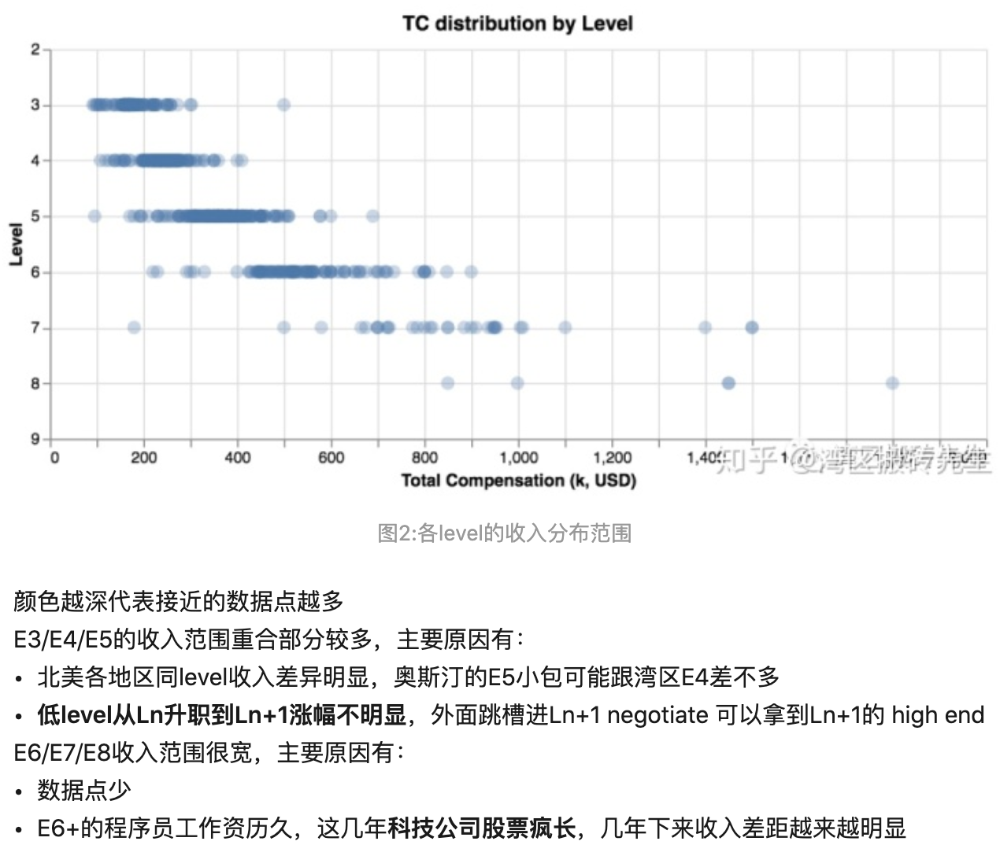
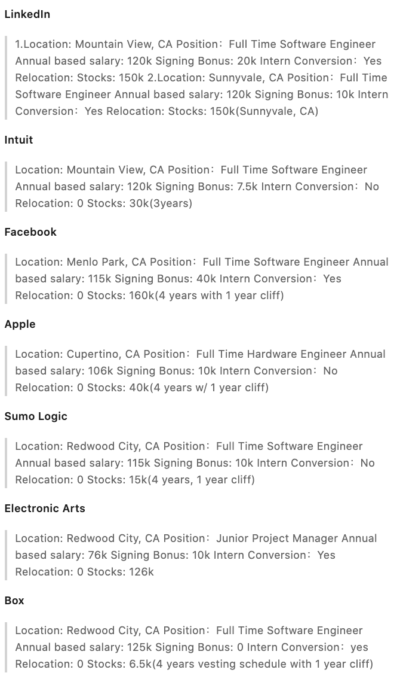
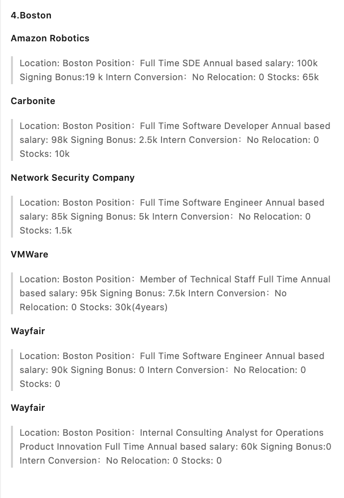
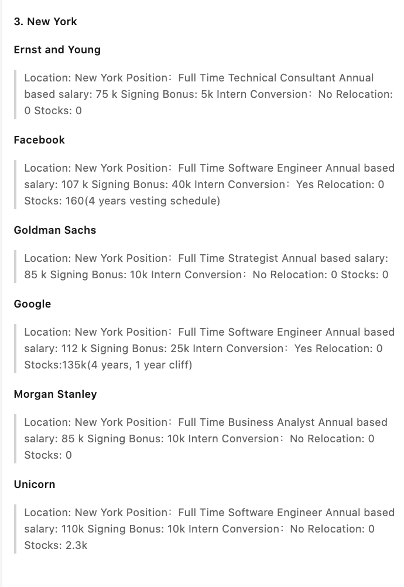
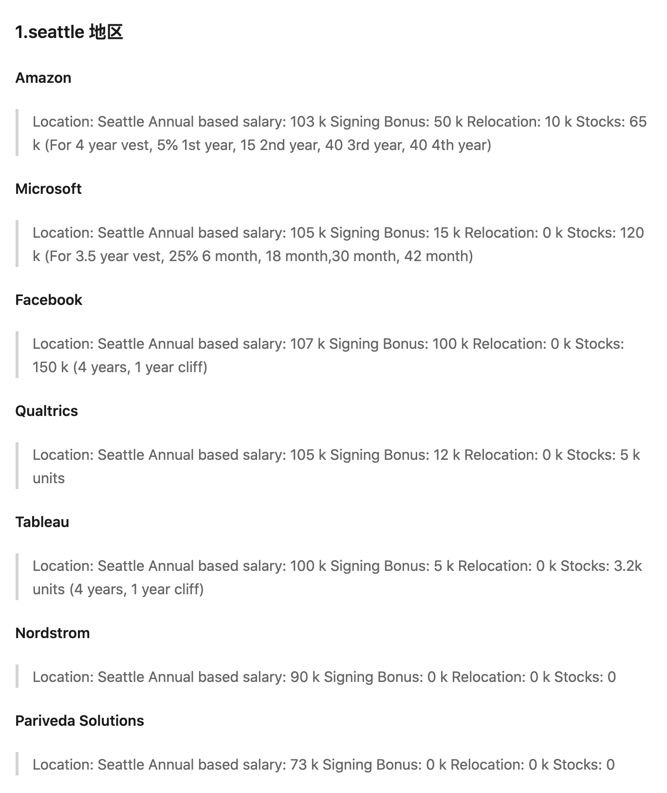

# 留学方式选取及IT职业长期规划

## 一、概念及专业用语的解释
### 1.留学术语
* CS：计算机科学（Computer Science）的缩写
* CE：计算机工程（Computer Engineering）的缩写
* AD：Admission Decision 最终录取的选择
* 留学咨询机构：只提供咨询、文书修改意见和有限的课程服务，提供同龄人相互竞争的环境。在其合同里的只有两个重点服务，一个是小型课程讲座，另一个是“接受咨询”。咨询师不直接修改文书，但是提供大量建议供申请者自我反复修改。
* 留学中介机构：全面承包留学过程的服务，基本不用自己动手
### 2.工作术语
* Package：西方国家IT行业对年总收入的形象称呼
* Manager：IT公司中的管理岗位
* Developer：多指软件的开发工程师
* MAGA：特朗普总统以自己"Make America Great Again"来称赞”Microsoft Apple Google Amazon"这四家万亿美金公司。也可指这四家公司
* FLAG：Facebook, LinkedIn, Amazon, Google 四家美国互联网巨头（似乎多用在华人圈子）也有人说“FLAG的全称其实是FLAG ™（T：Twitter, M: Microsoft）”

### 3.移民术语
* H1B 美国工作签证，抽签制
* OPT 美国大学毕业生实习签证，最多可延长36个月
* 绿卡 美国永久居留许可证
## 二、以留学机构为载体的留学方式

### 1.1.1 机构选择技巧
#### 1）不要只看广告
例如：某留学机构免费给TOP2前两名提供咨询，因为按照传统前两名无论如何都会被MIT录取…最后打出“大陆三个MIT化工PhD中的两个是在我们这儿咨询的”这样的广告，不了解内幕的人一定觉得这个机构NB爆了。
#### 2）“具体时间谁负责申请”更重要，而不是机构

一个顾问靠谱，不代表机构靠谱。你必须问清楚是那个人带你，她是什么背景，有多少成功案例，同时带多少人

本质上是在找老师。留学申请和机构关系不大，和你有关系的是具体负责你留学的老师。不同的人负责，从业背景，专业度，负责耐心程度等等完全不一样

机构前期接触的人都是销售，签约后就和你没关系了，一定要和真正负责自己留学的人见面

行业之间人员是流动的，好的老师很可能在不同的机构之间流动。不要偏信中介的名头，要去观察老师的背景和口碑

#### 3）选中介最好要选能退款，可以中途停止退出的

但中介一般会签订不准退款的协定（BBY就是这样）

#### 4）签合同不要冲动，起码要了解三个不同类型以上的机构。一定要很明确的知道自己从哪里，获得的什么服务。不要听天花乱坠的修辞。

#### 5）参考体量相似的人
 去找在该留学机构内申请之前硬件条件和你差不多（GPA，科研，GT成绩什么的）的学生问问他们的评价，然后对比一下这些学生的申请结果和不参加咨询机构的同等条件的同学的申请结果。小马过河，到底合不合适还得找体量相似的人问。

#### 6) 学会信息搜集，调整心态
当我们被英语考试，GPA，科研等等榨干了大部分精力之后，回到宿舍打开电脑一边看着一亩三分地的申请大神帖，一边看着那永远加载了一半的学校网站以及上面那密密麻麻的洋文，不免会让人发毛。大量的信息涌进脑子里难以消化(编辑内容未完待续)
### 1.1.2 留学机构的选择
#### 1 ）毕世盟（GGU）（留学中介机构）
* 其客户多为国内清北同学，故申请结果多较好
* 追求名校，不追求好的项目和专业。
* 价格相对较高
* 金融工程方面强
* mentor制：每个学员都会给分配一个现在正在国外就读master或者phd的学长学姐，而且他们的专业和学员的专业是一样的，所以他们对整个申请过程，包括对这个领域的理解都会很清楚
* 硕士半DIY是三万多，博士是两万多
* 免费的native speaker改文书：对申请社科或者商科的同学来说，这一点比较重要，但是对于申请理工科的人来说，也许起的作用并不是很大
* 发过去让mentor修改的文书，他们也会很快给你反馈
* 会组织两天的课程把申请的一些东西都给讲一遍
* A计划DIY来，询问一切你想知道的东西，伸手要所有内部资料模板，但你的所有申请材料第一稿都要自己打出来，之后的修改也要深度参与，所有的网申都自己填自己提交，所有的套磁自己做。
* 世毕盟老师会卡时间点提醒，但网申错过ddl没报上只能怪自己，套磁不够多没教授回复只能怪自己，别问。

#### 2 ）BeBeyond（留学咨询机构）
* 知乎好评较多
* Master 1W（2015秋天报名）
* 不太像留学机构，更像教育组织。
* 过程累
* 教你怎么挖掘自己的经历，怎么展示自己，以及引导思考未来的规划
* 留作业，学员之间还要互相讨论，培训师积极反馈
* 并非舔背景好、抛弃背景差的人
* 学到了很多解决问题的能力（field research，SA，Path等等，感觉这些方法会规范自己的思维模式，会更有效率地解决问题），而不只是学会了申请
* 同班的小伙伴也都是一群理想很坚定的人，感觉在他们身上也学到了很多珍贵的品质
* bebeyond的这种作业模式有些太极端化了，本身优秀的人经过这一系列会更优秀，但一般的同学可能要承受被大神碾压+无所适从
* 米总 知乎好评多
#### 3）Nuts （留学咨询机构）
* 知乎好评较多，但是也有很多匿名回答，需要仔细甄别，尽量参考实名回答
* 文书写得好是亮点。在写主文书的时候老师会很仔细的修改以外，后面不同的学校基本上只是细微的修改了。然后会有native polish，最后的文书还是很满意的。
* 咨询人员多为北美毕业。例如我vx中的一人咨询员毕业于NorthWestern University
* 南开大学金融2016级哈佛PhD就是在Nuts申请的，此同学本身实力极强，故战绩仅供参考。
* Gatech 刘硕 网络评价较好

#### 4）百利天下 （留学中介机构）
* 适合保姆式的留学
* 老师业务水平参差不齐
* 体量大，难以关照到每一个同学
* 知乎差评较多，流水化作业明显，不推荐
* 咨询人员学历有限。Nuts我咨询的是一个Umich的，而百利就是一个二本吧。
* 文书非常模版化，你写中文他们谷歌翻译，语法拼写错误连篇，保证气死申请季无比焦虑的你（来自匿名回答，真实性无法考证）
#### 5） 新东方 （留学中介机构）
* 收费相对高
* 体量大，基础保障好。
* 作者暂无精力收集此信息，后来的同学如果有精力和热情，欢迎contribute~

### 1.1.3 留学中介机构的缺点
* 中介在选校方面无法正确评估自己的全面实力
* 选校不自由
* 有些中介的文书写作水平极其有限
* 无法看到网络申请的进度
* 有些中介修改绩点、伪造推荐信的，会影响到自己的名誉
* 对自身人员配置的夸张
* 高昂的价格：几万到十几万
* 由于其高度不自由性，会让一些拔尖的同学失去更好的机会。
* 会出现没有留学经历的留学顾问
* 文书不给你上心：中介拿到钱之后跟拿到钱之前是完全不同的态度
* 对于有一定能力的学生，中介不是一个好选择
### 1.1.2 留学中介机构的优点
* 减轻我提高课内成绩的负担
* 对于计算机这种热门专业给出靠谱的建议。因为申请的人数多，中介积累下了大量经验
* 申请的陪伴和安慰
* 适合出国意愿不强烈的同学（如父母逼迫、自己主观能动性不强）
* 大量节约了自己时间
* 适合目标院校要求不高、资质较低的同学
* 磨平申请者差异，不会犯大错误
* 适合家庭条件好的人
### 1.2.1 留学咨询机构的缺点
* 不对申请结果负责，不直接替学生做任何工作
* 写文书主要还是自己写，会花费很多的时间和精力，尤其如果英文水平不好写的会很痛苦，这和全包的项目很不同。
* 不去问，懒，就只能收获到最基础的东西。就像自助餐一样，吃多少看你拿了多少，如果想参加DIY来帮助申请，结果和个人的勤快程度挂钩很大，如果自己懒，就真不值
### 1.2.1 留学咨询机构的优点
* 价格相对较低
* 自我发挥和掌控空间大
* 咨询师制度：遇到留学相关的问题想约谈咨询师，咨询师有义务接受咨询（面谈、电话）例：每周末都往nuts的办公室泡着的妹子，咨询师从来不直接修改文书，但是会提出大量的、多轮的建议和反馈，以供自我修改。如果自己主观意愿强烈愿意折腾，这种“师徒关系”给人的进步和成就感是很大的。
* 适合愿意和咨询师花大量时间沟通的同学，修改文书，资质中等偏上、时间充足、出国意愿强烈的同学
* 对冲击更高院校有积极作用

### 1.4 具体论述（亟待完善）

在申请季，当我们被英语考试，GPA，科研等等榨干了大部分精力之后，回到宿舍打开电脑一边看着一亩三分地的申请大神帖，一边看着那永远加载了一半的学校网站以及上面那密密麻麻的洋文，不免会让人发毛。大量的信息涌进脑子里难以消化，引出一系列问题：如何选校？如何陶瓷？如何写PS？问题会进一步引申出更多的问题。最终让人望而生畏，希望有人能够帮助自己完成申请。至少我当时是这么想的。

CV可以在国外的网上寻找专门的机构（美国人，有长期改简历的经验）

“我到底擅长什么？”“我应该去做什么？”这样的问题会在未来不断出现，即使现阶段解决了，随着自己的知识阅历积累可能会推翻自己过去某个时间节点上的论断，逼着自己反复思考。也就是在这一个过程中，我逐渐认识到免疫学PhD也许并不是我最适合的，比起在未知的生物医学领域中拓展，我更希望能够进一步吸收知识，同时运用自己的知识去协助优化现有的公共卫生资源分配，去帮助那些需要的人。并将这些知识分享给他们。这成为了我进入全球健康项目的契机之一。

## 三、美国留学中需要准备的事项
### 1.1 综述
申请这件事就是搞明白我从哪里来（为什么会成为现在的样子），到哪里去（想要成为什么样子），再看看现在想要做成什么（怎么利用我的优势和我想去的program到达我想去的地方）。

引用一句作者很喜欢的话：“在做申请之前，觉得申请结果大过天，如果申请失败了这辈子都很糟糕了。但是在搞清楚了这些问题之后，感觉申请结果不再是一个终点了，反而它只是人生这条线上的一点。无论什么样的结果带着走向不同路线，我知道自己都会向着同一个最终的方向延续。”

### 1.2 自主定位的方法
* Self-Analysis：思考我是什么样的人，我有什么特质，为什么会成为这样，擅长什么不擅长什么等等问题。思考的过程一定会有纠结和痛苦，但是不经历这些，就永远不会成长
* Field Research：用Field
Research收集的信息，去建立自己的规划和path，弄明白今后朝哪里走，成为什么样的人，去做什么样的事。
* Based On Facts
### 1.3 PS、CV构建经验（此版块需作者后续完善，因为我搜集信息搜集了八九个小时，现在非常想吐，为了避免吐一键盘，我晚点再更新）
#### 1 ） 留学咨询机构的材料准备
在留学咨询机构是不能偷懒的，不是指做了多少它的作业、写了多少版PS，而是指在战略层面上的思考不能偷懒。一直被引导（逼）着自己去思考为什么要这么做、怎么去把它做好等等问题会是很累的，在这里也没人会给你正确答案。但是在这里学到的思考方法，如果真的吃透了、理解了、内化了，是真的可以受益一生的。

在留学咨询机构我们会学到怎么样去reachout联系insider了解你想要的信息。这种向外reach out的能力极为重要地帮助我在申请的时候从四月的零积累到十二月申请的时候能有几段经验可以深度挖掘。这种能力直到现在都在帮助我探索这个专业的不同领域，认识不同的人。Mentor是被分配的变数太大，是否合适要随缘，如果遇到一个有负责专业又对口真的是有帮助，但也是可遇而不可求的。但是insider是自己主动找的，你可以决定去什么方向。

## 四、美国IT行业综合分析
### 1.1 综述
本版块以留学生角度（Bachelor/Master/PhD）角度，通过留学、实习、就业/进入当地高校任教的方法，对本国IT行业及其工作移民的相关政策进行分析

本人AkiyamaKunka是因为自己学业的某些原因，吸收到了来自网络和学校灌输的国际化思维，从而把眼光放得稍微远了一些。因为原生家庭的缘故，想借此作为学历提升、阅历丰富和阶级跃迁的跳板。

“在湾区（美国其他区域）生活，相当于选择了一条物质生活上的捷径。但生活本身没有捷径，我相信那些选择这些年回国打拼让自己辛苦的，肯定也会获得相应的回报。只是对于我们这些选择湾区生活的人，我想也没有必要被judge。能留在湾区的人，大部分也都是曾经在国内的佼佼者。Google Facebook Uber也不是每个人都能进的。每个人有不同选择罢了。”

这是作者目前确立长远规划的 Plan A ，我主观上同样欣赏选择这条道路的同窗。此路虽有风光无限，但是及其艰险，伴随政策的不确定性，客观上具有一定风险。仅供诸君参考

### 2. 薪资情况（作者一亩三分地的积分还不是很多，好多package的情况都看不到，我之后会更新，暂时先借用知乎一些网站的数据好了）
#### 1）收入构成
* 基本工资 Base:

这是写在入职合同上的固定收入，根据入职时的市场价、Level、面试表现、有无competing offer 等决定的。
升职后，基本工资会有所调整。在各大公司内部，不同的 level 对应一个范围，升值后有些公司会将 base 提高到下一个 level 范围的 p50，也就是中位数。

当然，具体情况具体讨论。比如，有些人在某一 level 待了很久，或者跳槽的包裹牛上天，很有可能他们现在的 base 已经是当前 level 的 high end（逼近下一个 level 的中位数），那升职后 base 只会微涨。

* 年终奖 Bonus:是对过去一年辛苦付出的肯定

年终奖各公司计算方法不同，湾区的几个大厂或多或少可以按照这个公式计算：

bonus = base * target_bonus_ratio * individual_multiplier * company_multiplier* manager's_tweak

其中，target bonus ratio 是固定的，level 越高，ratio 越大。Individual performance multiplier 是根据一年表现打分算得，company multiplier 是根据公司这一年基本状况算得。最后有些公司还有老板微调，每个小组会有一个 budget pool，根据小组成员贡献老板再稍微平衡一下

* 股票 Equity (RSU/Option)：初始股票 Initial grant + 新发股票 Refresh ：是对员工未来四年工作表现的期望

股票收入主要包含两部分：

初始合同一次性承诺给予，分四年（或五年）按月/季度/年发放。
各公司政策稍有不同，有些公司在员工入职一年后才开始按季度发（业内叫 one-year cliff），而有些公司入职第一个月就开始发。
不是所有公司都等额发放，比如亚麻头两年 5% 和 15%，后面两年各 40%，Snap 也有类似规定。

每年新发：
每过一年，公司会根据员工表现，新发一定股票，同样也是分四年发完。
新入职第一年，不是所有公司都给 refresh。
Uber 把 refresh 当成 bonus 的一部分，分 cash bonus 和 stock bonus。
各家公司 refresh 规定都不太一样，会随着市场情况调整，具体情况具体讨论

* 其他

除了以上提到几点，刚入职是还会有一笔现金签字费，入职后一定时间内支付，主要由 negotiation（有无 competing offer、公司多么想招你）决定。

另外，还有各大科技公司著名的好福利，比如健康保险、免费的一日三餐、健身房、游泳池，博物馆免费门票/打折票，车险、房屋保险、租车、买车、滑雪等一系列的 corporate rate，免费/打折的衣服干洗、理发、体检，commuter benefit 报销上下班公共交通，等等。

例外，大公司里面微软、亚麻和苹果没有免费食堂（部分 office 有，个人认为自己掏钱是好事）
Netflix 的福利，是给员工 all cash，很多很多 cash
#### 3）各个公司分级的中位数收入
* Facebook总况

* Facebook家薪酬上升情况

* 网站数据

#### 4）美国各地区收入数据参考
* 湾区薪酬

* 波士顿薪酬

* 纽约薪酬

* 西雅图薪酬

#### 5）湾区、西雅图地区薪酬总结
* FLAG大厂：140k总包+135k股票（4年经验）

* 小厂，例如Salesforce： 115k总包+75k股票（四年经验）
#### 6）纽约、波士顿地区薪酬总结
* FLAG大厂：110k总包+65k股票（四年经验）

* 小厂，例如VMWare：100k总包+30k股票（四年经验）
### 3. 职场级别
#### 1）fresh level：应届毕业生/工作一年跳槽/合同工
#### 2）Junior level：转正的小伙伴，会拿到 L3/E3/T3/SDE I/IC I 等这些 level
* 在一定指导下，完成指定任务
* 在一定指导下，参与系统设计
* 产出质量尚可
* 新人 ramp up 可以是半年到一年
#### 3）Median level：博士毕业生、工作个两、三、四年再跳槽的小伙伴，会拿到 L4/E4/T4/SDE II/IC II 等这些 level
* 在 minimum guidance 下，完成有一定挑战的任务
* 在 minimum guidance 下，完成系统设计
* 逐步成为一些项目的 go-to person（有问题就知道可以问你）
* 工作完成质量高
* 最佳状态：能够独立工作，包括项目系统设计、实现、协调各方、测试、内测、QA、文档、做实验、发布这一系列的任务
* 新人 ramp up 可以是三个月到半年
#### 4）Senior level：L5/E5/T5/Senior，到达这一级每家公司需要的时间差异挺大，相应的机遇成分也开始变得重要

* 独立自主，完成上面提到的一系列工作
* 独立自主，攻克模棱两可的问题，提出完美/次完美/临时/长期的解决方案，成为组里的技术专家
* 项目负责人，或者成为一个产品分支的负责人，带领团队，完成系统设计、开发、测试等一系列的工作
* 自我驱动，也能带动、影响身边的人，制定自我优先级、制定小组优先级
* 写代码之外，更加注重系统的稳定性、扩展性、安全性、监控、报警、文档、跨组、跨部门甚至跨公司协调工作
* 更佳的状态：协调组内资源、争取内外部资源、招人、带人、扩大 scope

#### 5）巨神：老年人之后的 level，各公司叫法不一，Staff、Principal、抑或是直接用数字表示。到这一 level，个人能力是一方面，个人精力、愿意付出的时间、机遇等因素会扮演更加重要的角色。

* 做好以上的所有工作
* 更多地参与战略、资源、季度/年度优先级的讨论
* 标准化整个团队的工作、提高团队的工作效率、产出水准、工作范围
* 培养团队，帮助小伙伴成长
* 可以解决没有人解决过的问题，进入全新或非常有挑战的领域
* 可以管理10+的人
* 可以是一个领域内的专家，对这个领域的未来都能带来影响

#### 6）People Manager
以上提到的是 IC 岗，Individual Contributor，如果转 People Manager，或者是依然做技术的 Teach Lead Manger (TLM)，那 L5 一般对应 M0， L6 是 M1，以此类推。

#### 7）补充
以上只是部分大公司常见的 level 分法，老年人这一级，Uber 还会细分 5.a 和 5.b，微软有 63 和 64，而 Netflix 所有人都是 senior

目前没看到程序员到 35 岁就一定要转管理的现象，转与不转，这取决于机遇、个人性格以及家庭等多方面因素，我周围非常多 high level IC，WLB 好得很，也不用处理很多 dirty work，收入跟 level 相关，跟 title 无强相关

### 4. 职业环境
#### 1）华人程序员发展
“当然在美国，华人程序员确实很难取得很高的社会地位，美国总体来说不是完全以财富划分社会地位的。至于一些回答说什么ABC怎么自卑，怎么恨自己不是白人，我觉得就是扯J8淡了，大部分写这些回答的人自己孩子都没有。在南湾这种亚裔占了接近30%，好学区一半多都是亚裔的地方，我不知道亚裔有啥好自卑的，ABC又没有我们这一代的语言问题。”

### 5. 生活环境

### 6. 心态和实际感受

（本段摘抄自湾区华人程序员亲身经历）

“回想起15年1月，从成都阴沉的雾霾里起飞降落在阳光明媚的三番机场，准备接下来的面试，心里想着这世界上还有比湾区更宜居的地方吗，暗自发誓一定要生活在湾区。在101，880上，眼里只有双向8车道的高速，高速围墙上美丽的爬山虎和无敌的蓝天，根本注意不到什么路边的垃圾。3年里，湾区并没有变，只是我们对这里新鲜感消退了，对美国的新鲜感消退了。得到了那份曾梦想的年薪10几万20万美元的工作，却开始恐惧一眼能看到头的人生。在美国快接近6年，直到一年的多以前，都没有过回国的念头。来自一个非常普通的教师家庭，前两年学生时期当然是无限憧憬那份年薪十几万美元的工作，以为得到那份工作之后就能立马获得幸福感的巨大提升。刚开始的一两年确实是这样，拿到第一张paycheck的第二天，就去奔驰把人生第一辆车开了回来，然后发票圈，装逼，美滋滋。感觉自己有钱的一逼，公司福利好的一B。工作上的新鲜感刚刚开始消退，又沉迷上了湾区最佳运动 —— 滑雪。那几年，是真的没怎么考虑过回国的事情。

然而后来感觉到金钱对幸福感的边际效应递减。买了奔驰，买了特斯拉，买了大房子，然后呢？然后你心情不好的时候坐进车里就好了？除了一开始几天，难道你每天坐进车里的时候看到奔驰的标志就高潮了？每天住在大房子里就感觉特别爽就不会无聊？然后，好像突然不知道该追求些什么。新鲜感也逐渐消退，开始觉得湾区夏天那黄草遍野特别的丑，连云都没有的蓝天下特别的晒。然后开始怀念起那些湾区或者美国没有的东西。

怀念起国内车水马龙的热闹感。怀念起大学时候网吧五连坐开黑的日子，怀念起国内的公寓打开窗能听见楼下嬉嬉闹闹的街坊邻居，怀念起路边的夜烧烤，怀念起学生时代暑假里唱K聚餐，怀念起北京地铁十号线报站的声音，怀念那种对未来充满未知，充满幻想的心境。

人就是这样，没有什么就想要什么，有什么就不珍惜什么。在北京上大学时候，渺小的我走在拥挤的地铁换乘通道里。现在在湾区的生活，有着大房子，开着好车，想买什么衣服买什么衣服，想换什么手机换什么手机，就是那时候的我梦想的生活。而现在，当你有了这些，又开始怀念大学宿舍几个室友住在一起可以开黑，怀念一起打魔兽那种激情。

所以我说： 人就是贱。于是就不停的有想回国的冲动。可是你仔细观察那些回国了和待在国内的朋友，就会发现很多你怀念的事情，你以为在国内可以拥有的事情，很多都是一厢情愿。每次回国去看母校，去看小时候生活的地方，都会有一种物是人非的感觉。还是想明白了，我并不是真正的想回国，只是怀念以前美好的日子和以前的激情而已，只是正好那时候在国内罢了。

其实想回的并不是国，想回的是回不去的青春。”

### 7. 关于是否回国的思考
### 7.1 选择不回国的理由
#### 1）不过度透支身体就可获得让人非常满足的经济收入
“不知道硅谷的这种高收入情况能持续多久，就目前来说，我和女朋友（已订婚）两个人加起来一年的税前收入在45至50万美元之间。标准的朝10晚6。以前大家一般认为美元的购买力大概在1比3-4人民币之间。个人感觉，如果是湾区跟北上深比的话，考虑到北上深逆天的房价，车牌价，消费水平。实际购买力差不多接近汇率的比例。”
#### 2）回国难以有客观的上限突破

“个人感觉未来几十年，国内的发展，利好的因素有国民素质提升啦，教育水平提升，科技提升等等等。但这些利好不知道能不能抵消人口老龄化，劳动力减少，发展瓶颈，贫富差距加大这些利空的影响。每次回国跟大家聊上一圈，有权有势有钱的精英普遍都有点看衰，混的不咋样的倒是很多莫名乐观.. 总之个人是觉得国内以后发财的机会，阶层跃迁的机会会越来越少。”

#### 3）政治因素

不多评价，作者惜命

#### 4）对国内的想象，在实际回国之后并没能得到满足

“太多人已经尝试过了，当然不是每一个人，但很多非常符合我说的例子。回国前两个月觉得什么都好，每天PO吃的，PO自己投身一个快速发展的经济体多么多么激动。然后很快就被打得鼻青脸肿。在湾区的时候怀念国内的热闹，热闹了没两个月就受不了人山人海，受不了地铁的挤，开始怀念湾区开车上班，怀念加州冬天的阳光。回国之前想象的国内，发现并得不到。个人猜想回国前一两个月跟老朋友都相聚一圈之后，发现大家都是各忙各的，没有人每天陪你聚，他们也有房贷，也有工作。

回国与不回国确实成了一个很多人都在讨论的问题。也侧面说明了中国过去20年确实发展的很快。比如周围印度，巴西，非洲和东欧穷国的同事，除了特别思乡的基本都不用想这个问题。自己国家物质条件跟美国差了太多。而中国大城市的物质生活水平跟美国基本没什么明显的差距了，基建治安等一些地方甚至更强。目前暂时没选择回国，还是想多享受享受一下现在的自由。我知道，这个世界上是有一些斗士的，他们不爱往回看，也没有时间回头看。一生都在战斗，都在影响着这个世界。比如Elon Musk，贝索斯这样的人。99.99%的可能是和我一样的平凡人。不管是否奋斗。我是绝不接受任何形式的以身体换钱的行为。人的一生没有想象的那么长，大部分人的身体机能从50岁之后就要急速下降了。如果你现在30岁，其实剩下的黄金岁月就只有20年了。如果你在年轻的时候透支了身体，衰老提前到了，那么这个时间可能更短。很多时候，一忙起来很多人都忘记我们能享受这一生的时间没有想象的那么多。

## 五、美国工作、永居以移民政策分析

## 六、其他国家工作、永居以及移民政策分析
### 1.1 综述
本版块以留学生角度（Master/PhD）角度，通过留学、实习、就业/进入当地高校任教的方法，对本国IT行业及其工作移民的相关政策进行分析。
### 1.2 选择这些国家的原因
* 紧缺技术人才，每年大把从海外招技术人才过去补充高端劳动力（欧洲或日本、新加坡等发达国家）
* 薪资相对不低
* 政策友好：工作满一定时间后直接给永居（绿卡），全家享受该国的福利待遇
* 无996，工作轻松

以德国为例，每年从海外引进的人才（例如：软件工程师、设计师、项目经理等）几万，还远远赶不上缺口的增加量

### 2. 加拿大
### 3. 澳大利亚
### 4. 新加坡
### 5. 北欧
“作为在北欧工作的程序员，表示我们这边几乎是935，早上9:30到公司，工作到11:30出门吃饭，12:30回来继续上班，14:00有个下午茶（我们称之为Fika，喝咖啡吃零食聊天），15:00之后大家几乎就陆陆续续走人了，17:00连公司大门都关了。之前在德国工作时，德国稍微辛苦一些，大约是下午17:00才下班，但也从来不考虑加班的问题。

欧洲很看重工作与生活的平衡，并且程序员可以一直做到退休，我所在的公司去年还从英国招聘来一个快70的老爷爷做技术，跟这位老爷爷聊天得知：他仅仅是对技术非常有兴趣，不想退休，想继续坚持自己的兴趣做下去。作为一个88年的程序员，在公司几乎没看到几个人年龄比我小。最后我是毕业后在国内工作了几年，受够了国内的加班，直接申请了国外的工作出来了，有几年工作经验的程序员在国外是抢手货。”

### 6. 日本 

## 本文未完待续，作者在2020年六月会继续更新完善。也欢迎志同道合的同学和前辈们contribute！
## Make your life beautiful again！